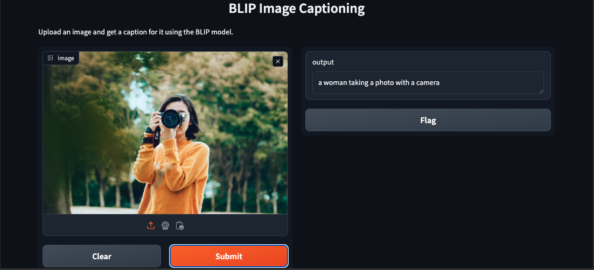

# Automated Image Captioning using Transformers

This repository provides a comprehensive solution for automated image captioning using advanced deep-learning techniques. It includes multiple scripts and Jupyter notebooks that leverage different models and frameworks to generate captions for images.

## Repository Structure

- **automated_url_captioner.py**: This script allows you to generate captions for images provided via URLs. It utilizes pre-trained models to interpret and describe the contents of images.
  
- **Gradio notebook.ipynb**: A Jupyter Notebook demonstrating how to use Gradio to create a web-based interface for image captioning. Gradio provides an easy-to-use platform to build interactive interfaces for machine learning models.

- **Image captioning BLIP.ipynb**: This notebook implements the BLIP (Bootstrapping Language-Image Pre-training) model for image captioning. BLIP is a state-of-the-art model that improves image captioning performance by leveraging large-scale pre-training.

- **image_cap.py**: A script for generating captions for local image files. It reads images from the local filesystem and produces descriptive captions using a deep learning model.

- **image_captioning_app.py**: This Python script sets up a web application using Flask. The application allows users to upload images and receive captions generated by a pre-trained model.

## Demo


## Getting Started

### Prerequisites

Before you begin, ensure you have the following installed:

- Python 3.8 or higher
- Jupyter Notebook
- Gradio
- Flask
- Other required Python libraries listed in `requirements.txt`

### Installation
Clone the repository:
    ```bash
    git clone https://github.com/axiom19/automated-image-captioning.git
    cd automated-image-captioning
    ```
